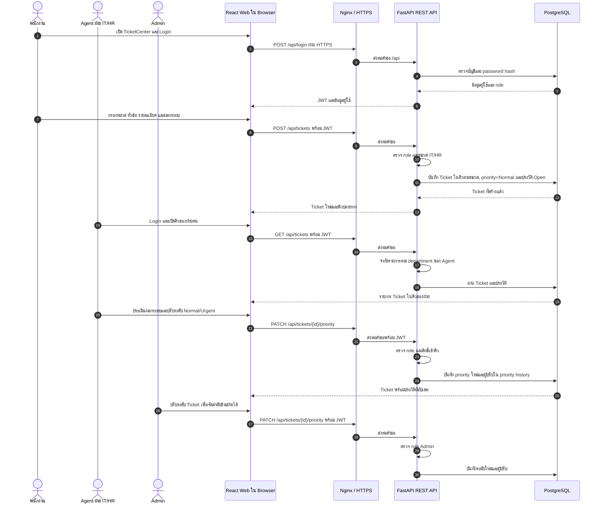
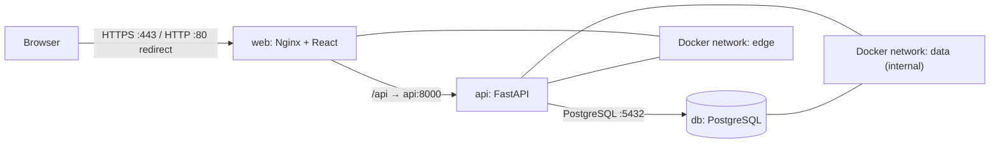
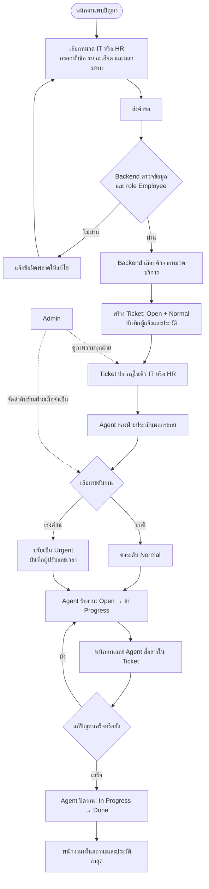
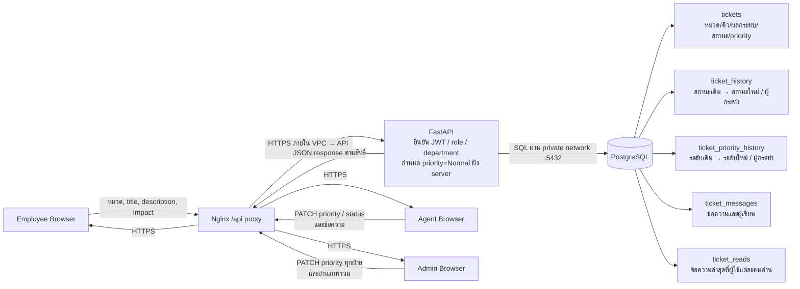

# TicketCenter — System & Architecture Flows

เอกสารนี้สรุปการทำงานของ MVP ตามโค้ดปัจจุบันและตัวอย่าง AWS Terraform ใน `infra/aws` ใช้ Mermaid สำหรับแสดงแผนภาพ (แนะนำเปิดใน GitHub หรือ Mermaid Live Editor เพื่อดูภาพ)

## 1. System Flow



## 2. Architecture

### AWS deployment (ตัวอย่างใน Terraform)

```mermaid
flowchart TB
    Internet((Internet / Browser))
    subgraph VPC["AWS VPC — 10.42.0.0/16"]
      subgraph Public["Public subnets — 2 AZ"]
        IGW["Internet Gateway"]
        ALB["Application Load Balancer\nHTTPS :443 · ACM certificate"]
        WEB["ECS Fargate Web\nReact static + Nginx\nมี public IP; รับจาก ALB เท่านั้น"]
        NAT["NAT Gateway\nทางออกจาก private subnet"]
      end
      subgraph Private["Private subnets — 2 AZ"]
        API["ECS Fargate API\nFastAPI :8000\nassign_public_ip = false"]
        RDS[("Amazon RDS PostgreSQL :5432\npublicly_accessible = false\nเข้ารหัส storage"])
      end
      Secrets["AWS Secrets Manager\nJWT / DB credentials"]
      Logs["CloudWatch Logs"]
    end

    Internet -->|"HTTPS :443"| ALB
    ALB -->|"HTTPS :443; ALB SG → Web SG"| WEB
    WEB -->|"/api ผ่าน private DNS · TCP :8000"| API
    API -->|"TCP :5432"| RDS
    API -. "ออก HTTPS ผ่าน NAT เพื่อดึง secret / ส่ง logs" .-> NAT
    WEB -. "ออก HTTPS ตามที่จำเป็น ผ่าน IGW" .-> IGW
    IGW -. "route 0.0.0.0/0 ของ public subnet" .-> Internet
    API -. "execution role อ่าน secret" .-> Secrets
    WEB -. "ส่ง logs" .-> Logs
    API -. "ส่ง logs" .-> Logs
```

**กติกาเครือข่าย:** Internet รับเข้าได้ที่ ALB พอร์ต 443 เท่านั้น (พอร์ต 80 ยังไม่ได้ตั้ง listener ใน Terraform ปัจจุบัน). Web รับ HTTPS จาก ALB; Web ส่งต่อ API ได้ที่ 8000; API เชื่อม PostgreSQL ที่ 5432. Backend และ RDS อยู่ private subnet และไม่มี public IP/public endpoint. ไม่มี SSH ingress. NAT ใช้สำหรับ outbound จาก private subnet เท่านั้น.

### Local development ด้วย Docker Compose



Compose publish เฉพาะพอร์ตของ Web ที่เครื่อง host; API และ DB ไม่มี published port. Docker networks `edge`/`data` ช่วยแยกการเชื่อมต่อในเครื่อง แต่ **ไม่ใช่หลักฐานว่ามี AWS public/private subnet จริง**.

## 3. Business Flow



## 4. Data Flow



### ข้อมูลหลักที่จัดเก็บ

| ตาราง | ใช้เก็บ |
|---|---|
| `users` | อีเมล, password hash, role และฝ่ายของผู้ใช้ |
| `tickets` | หัวข้อ, รายละเอียด, ผลกระทบ, หมวด/คิว, สถานะ, ความเร่งด่วน, ผู้แจ้ง และเวลาสร้าง |
| `ticket_history` | การสร้างและการเปลี่ยนสถานะ พร้อมผู้กระทำ |
| `ticket_priority_history` | การเปลี่ยนความเร่งด่วน พร้อมผู้ปรับและระดับก่อน/หลัง |
| `ticket_messages` | ข้อความสนทนาใน Ticket และผู้เขียน |
| `ticket_reads` | จุดที่ผู้ใช้แต่ละคนอ่านถึง ใช้คำนวณ unread count |

## ประเด็นที่ใช้ตอบ Technical Review Board

- **แบ่ง Tier:** Browser/Nginx อยู่ด้าน public; FastAPI และ PostgreSQL อยู่ private ใน AWS deployment.
- **Least privilege:** เปิดเส้นทางตามหน้าที่: Internet → ALB 443, ALB → Web 443, Web → API 8000, API → DB 5432.
- **ตรวจสิทธิ์ใน Backend:** Frontend ซ่อนข้อมูลตาม role เพื่อ UX แต่ API เป็นผู้บังคับสิทธิ์จริง; Agent ถูกจำกัดตามฝ่าย และ Admin เห็นทุกฝ่าย.
- **แก้ปัญหาธุรกิจ:** คำขอมีผลกระทบเป็นข้อมูลประกอบ; เจ้าหน้าที่เป็นผู้กำหนดความเร่งด่วน; ผู้แจ้งติดตามสถานะ ประวัติ และสนทนาได้ใน Ticket เดียว.
- **Auditability:** สถานะและความเร่งด่วนมีผู้กระทำและเวลาอยู่ในประวัติ.
